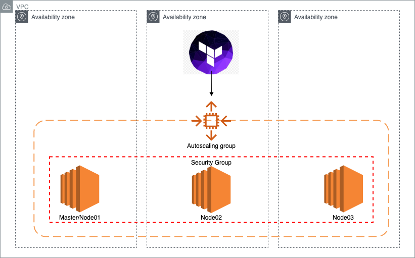
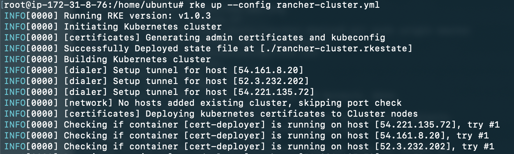
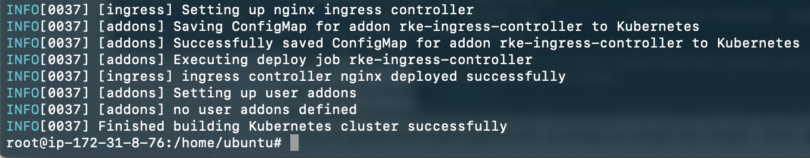
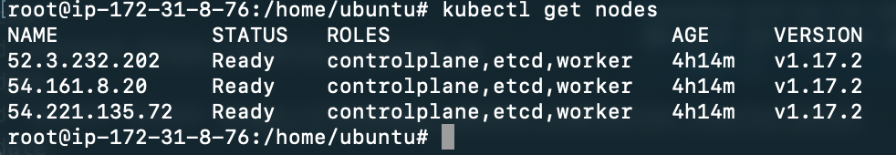

# H1 Deploying highly available K8s cluster using RKE
RKE is a useful tool that help with configuring K8s clusters. In this use case we will deploy a highly available K8s cluster using RKE.
We will also use Terraform in order to deploy the required compute resources into AWS.

# H2 The following infra diagram describes the resources that will be deployed

# H2 Services that will be installed on the ndoes
 - Docker
 - RKE
 - kubectl
 - Helm

# H2 Post install

1. SSH into the master node using its public IP

2. Edit the `rancher-cluster.yml` and update the IP addresses of the nodes. Also, update the  path to your SSH private key ([How to create SSH key pairs](https://help.ubuntu.com/community/SSH/OpenSSH/Keys)) for authentication between the nodes.

`
nodes:
  - address: <Node01 IP Address>
    user: ubuntu
    role: [controlplane,etcd,worker]
    ssh_key_path: /path/to/privatekey.pem
  - address: <Node02 IP Address>
    user: ubuntu
    role: [controlplane,etcd,worker]
    ssh_key_path: /path/to/privatekey.pemm
  - address: <Node03 IP Address>
    user: ubuntu
    role: [controlplane,etcd,worker]
    ssh_key_path: /path/to/privatekey.pem
addon_job_timeout: 120
`

3. Run the up command to initiate the creation of the cluster
`rke up config rancher-cluster.yml`

You will then see the following output. This output indecates that the setup has started and that the tunnels to the hosts have been created. Using the SSH key pair fro the previous step.

After a few moments you will get a success output:

4. Check that the cluster is running properly
`kubectl get nodes`

This should give you the running nodes in the cluster

